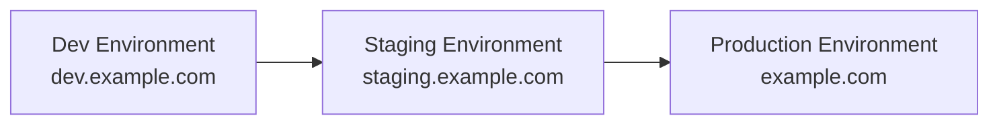

# Deployment Workflow Design

## 1. Branch Strategy
```
feature/fix branches → dev → staging → main
```
- **Feature/Fix Branches**: For active development
  - Named as `feature/feature-name` or `fix/bug-name`
  - Created from `dev` branch
  - Merged back to `dev` via Pull Request

- **Dev Branch**: Integration branch for feature work
  - Continuous integration
  - Automated tests run on every push
  - Deploys to development environment

- **Staging Branch**: Pre-production testing
  - Promotes code from `dev`
  - Full integration testing
  - Production-like environment
  - Required approvals

- **Main Branch**: Production-ready code
  - Promotes from `staging` only
  - Protected branch
  - Tagged releases
  - Production deployments

## 2. Environment Setup and Isolation

### Infrastructure


### Environment Isolation
- Separate virtual machines for each environment
- Isolated networks and security groups
- Environment-specific configurations via GitHub Environments
- Dedicated domains/subdomains per environment

### Access Control
- Dev: Development team access
- Staging: Limited to senior developers and leads
- Production: Admin access only

## 3. Promotion Process

### Development Environment
- Automatic deployments on merges to dev branch
- Basic automated tests must pass
- No manual approval required
- Continuous deployment enabled

### Staging Environment
- Triggered on successful dev deployment
- Requires manual approval from team lead
- Full test suite must pass
- Integration testing environment
- Performance testing

### Production Environment
- Requires multiple approvals (minimum 2)
- Must pass all tests + security scans
- Scheduled deployment windows
- Change management documentation required
- Automated and manual health checks

## 4. Rollback Strategy

### Automated Rollback Triggers
- Failed health checks (3 consecutive failures)
- Error rate exceeds 5% in 5 minutes
- Response time increases by 300% over baseline
- Critical security alerts

### Rollback Methods
1. **Container Version Rollback**
   - Revert to last known good image
   - Automated database rollback if needed
   - Configuration version control

2. **DNS Failover**
   - Blue-green deployment switch
   - Load balancer reconfiguration
   - Geographic DNS failover if needed

3. **Data Recovery**
   - Database point-in-time recovery
   - Backup restoration procedures
   - Data consistency verification

### Recovery Process
1. **Automated Recovery**
   - Self-healing attempts
   - Scale adjustments
   - Service restarts

2. **Manual Intervention**
   - Incident response team notification
   - War room procedures
   - Status page updates

3. **Post-Recovery**
   - Root cause analysis
   - Incident documentation
   - Preventive measures

## 5. Monitoring and Metrics

### Application Metrics
- Response times (p50, p90, p99)
- Error rates per service
- Request volume
- Business metrics (conversions, transactions)

### Infrastructure Metrics
- CPU/Memory utilization
- Network throughput
- Disk I/O and usage
- Container health

### Monitoring Stack
- Prometheus for metrics collection
- Grafana for visualization
- AlertManager for alerts
- ELK stack for logs

### Alerting Configuration
1. **Severity Levels**
   - P0: Critical - Immediate response required
   - P1: High - Response within 30 minutes
   - P2: Medium - Response within 2 hours
   - P3: Low - Next business day

2. **On-call Rotation**
   - Primary and secondary on-call
   - Escalation paths
   - Regional coverage

## 6. Secret Management

### GitHub Secrets
- Environment-specific secrets
- Automated rotation every 90 days
- Access audit logging
- Multi-factor authentication required

### Infrastructure Secrets
1. **SSH Keys**
   - Per-environment key pairs
   - Rotated every 30 days
   - Access logs retained for 90 days

2. **API Tokens**
   - Service-specific tokens
   - Limited scope access
   - Automatic expiration

3. **Database Credentials**
   - Per-service credentials
   - Read/write permission separation
   - Automated rotation

## 7. Version Control and Tagging

### Version Numbering
- Semantic Versioning (MAJOR.MINOR.PATCH)
- Release Candidates: rc.N (e.g., 1.0.0-rc.1)
- Environment Tags: env-timestamp (e.g., prod-20231028)

### Automated Processes
1. **Git Tagging**
   ```bash
   v1.0.0              # Release version
   v1.0.0-rc.1         # Release candidate
   v1.0.0-dev.123      # Development build
   ```

2. **Docker Images**
   ```bash
   app:1.0.0           # Release version
   app:1.0.0-rc.1      # Release candidate
   app:dev-latest      # Development latest
   ```

3. **Release Notes**
   - Auto-generated from PR descriptions
   - Changelog maintenance
   - Breaking changes highlighted

## 8. Implementation Checklist

### Initial Setup
- [ ] Configure GitHub Environments
- [ ] Set up branch protection rules
- [ ] Create deployment infrastructure
- [ ] Configure monitoring stack

### Workflow Implementation
- [ ] Create GitHub Actions workflow
- [ ] Set up environment secrets
- [ ] Configure deployment approvals
- [ ] Implement health checks

### Documentation
- [ ] Create runbooks
- [ ] Document rollback procedures
- [ ] Write incident response plan
- [ ] Create training materials
